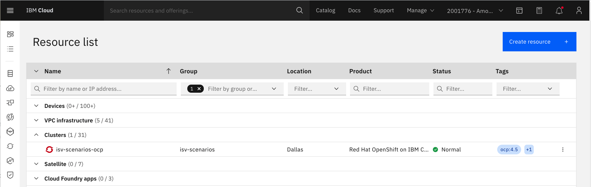
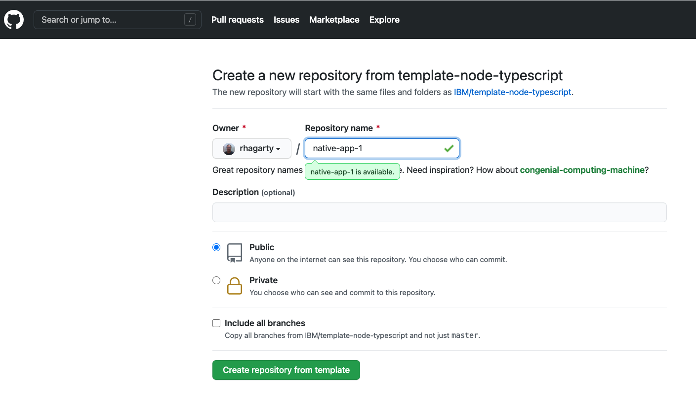
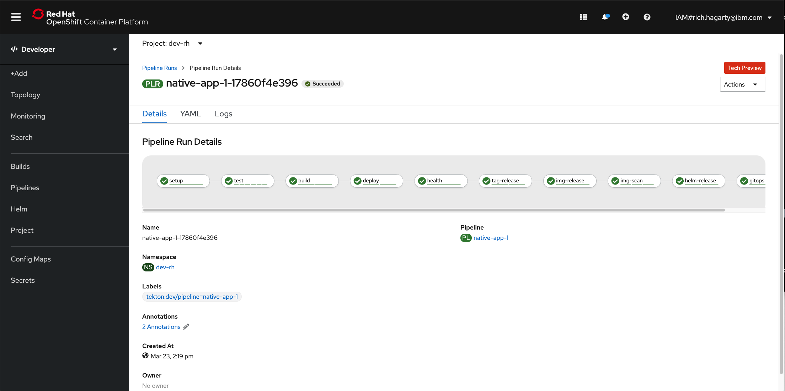

# ubi-work

## Background

UBI - Universal Base Image

    * works on OpenShift and k8s
    * vehicle for building and delivering certified containers and operators
    * comes in different flavors - nodejs, python, java, etc
    * licensed for redistribution

UI - Universal Image (our current IBM ISV definition)

    * certifiable container image, built on a UBI 

Work items:

* build a custom image (JanusGraph)
* Fork or clone the JanusGraph image
* change dockerfile using toolkit
* whenever JanusGraph image is update, pull latest changes and rebuild
* rebuild = kick of pipeline in tekton
* learn starter kit tutorial (cloudnativetoolkit.dev)

2 approaches:

1. Start with starter kit
    * python (JanusGraph is java)
    * sub out /src with new code from sample code
    * tests will not work
    * run toolkit

2. Take sample app and then add in meta data to get to work
    * meta data probably from starter kit
    * `igc enable` will populate repo with stuff toolkit will need 

Cloud-Native Toolkit Guide : https://cloudnativetoolkit.dev/

Tutorial on how to how to build a UBI from a starter kit:
https://github.ibm.com/TT-ISV-org/images/blob/main/toolkit/build-starter-kit.md

What is the toolkit?

## Install Developers Toolkit on local machine

1. Pre-reqs: https://cloudnativetoolkit.dev/getting-started/prereqs/

    * Generate new Personal Access Token on my public github account:
        * Name is "CI Pipleline"
    * Generate new IBM Cloud API Key
        * IBM Cloud account under Amol's account
        * Name is "native-toolkit"
2. Developer Tools Setup: https://cloudnativetoolkit.dev/getting-started/dev-env-setup/

    * Take local laptop path
    * Requires Docker Desktop (I have 3.2.1)
    * Requires Git client (I have 2.24.3)
    * Requires VS Code (I have 1.48.0)
        * enable it to launch from command line - https://code.visualstudio.com/docs/setup/mac#_launching-from-the-command-line
    * Install cloud native tooklit. Setup shell env:

        ```bash
         $ curl -sL shell.cloudnativetoolkit.dev | sh -
         $ source ~/.bashrc || source ~/.zshrc
        ```

        * When I start a new `term` window, I am using my `~/.bash_profile`, so I need to source in my `.bashrc` file which is where all the new toolkit settings are:

            ```bash
            source .bashrc
            ```

    * configure git:

        ```bash
        git config -l
        ```

        * Make sure user.name and user.email are set

    * Tools included with cloud native toolkit:

        * IBM Cloud cli (ibmcloud)
        * ArgoCD cli (argocd)
        * Tekton cli (tkn)
        * IBM Cloud fast switching (icc)
        * kube-ps1 prompt
        * OpenShift cli (oc)
        * Kubernetes cli (kubectl)
        * JSON cli (jq)
        * IBM Garage Cloud CLI (igc)

    * Configure option ICC tool - https://cloudnativetoolkit.dev/getting-started/icc/
        * requires `yg` v3.3.2 - https://docs.pivotal.io/scdf-k8s/1-1/installing-command-line-tools.html#macos
        * `icc --add-acount`
            * Enter name for your account. Should reference which cloud account you are using to access the OpenShift cluster. e.g. `amols-account`
            * Enter IBM Cloud API key you created for this task.
            * once created, you should have a new file named `ibmcloud-account.yaml`
        * `icc --generate` to generate cluster config
            * once created, you should have a new file named `ibmcloud.yaml`
        * run `icc` to list the clusters:

            ```bash
            $ icc
            demo_amol - amols-account/default/demo_amol
            aida-cpd3-dal10-b3c.56x242 - amols-account/default/aida-cpd3-dal10-b3c.56x242
            koyfman-sept18-cleanup-test - amols-account/default/koyfman-sept18-cleanup-test
            isv-scenarios-ocp - amols-account/isv-scenarios/isv-scenarios-ocp
            ```

            * Shows cluster name - then account to access it, the resource group, then cluster name

            * We want access to `isv-scenarios-ocp`, which has the starter kit

                

            * give the cluster a nickname so easier to log into - `icc --nickname`

                ```bash
                $ icc --nickname
                Please provide the current cluster name or nickname: isv-scenarios-ocp
                Provide the new nickname for isv-scenarios-ocp: toolkit-cluster
                Nickname for isv-scenarios-ocp updated to toolkit-cluster in /Users/rhagarty/ibmcloud.yaml
                ```

            * log into cluster using `icc toolkit-cluster`

                ```bash
                $ icc toolkit-cluster
                Logging into ibmcloud: us-south/isv-scenarios
                Logging into OpenShift cluster isv-scenarios-ocp with server url https://c116-e.us-south.containers.cloud.ibm.com:31047
                ```

## Deploy App - clone a starter-kit and connect it to the pipeline

Directions: https://cloudnativetoolkit.dev/getting-started-day-1/deploy-app/

IBM Garage Cloud CLI (igc) - not required, but makes it much easier

* Log in to OpenShift Console - `oc console`

* Create and use `dev-rh` project namespace. Sync to get secrets and config maps:

    ```bash
    $oc sync dev-rh
    Setting up namespace dev-rh
    Setting up namespace: dev-rh
    Checking for existing project: dev-rh
    Creating project: dev-rh
    Copying ConfigMaps
    Copying Secrets
    Setting current project to dev-rh
    ```

* Note that instructions should be **UPDATED** to explicity state **NOT** to use the tools project.

* Open Developer Dashboard from OC console:

    

* Can also use `oc dashboard` to launch straight to dashboard.

* Click on `Starter Kits`, and then select `Typescript Microservice`. Will take you to github to create a repo for your app.

    

* Create DevOps pipeline

```bash
$ oc pipeline https://github.com/rhagarty/native-app-1.git
? Select the type of pipeline that should be run? Tekton
Creating pipeline on openshift cluster in tools namespace
Retrieving git parameters
  Project git repo: https://github.com/rhagarty/native-app-1.git
? Provide the git username: rhagarty
? Provide the git password or personal access token: [hidden]
  Branch: master
Retrieving available template pipelines from tools
Pipeline templates filtered based on detected runtime: nodejs
Selected pipeline: ibm-nodejs
? scan-image: Enable the pipeline to scan the image for vulnerabilities? Yes
Copying tasks from tools
Copied Pipeline from tools/ibm-nodejs to tools/native-app-1
Creating TriggerTemplate for pipeline: native-app-1
Creating TriggerBinding for pipeline: native-app-1
Creating/updating TriggerEventListener for pipeline: tekton
  Creating new event listener
  Waiting for event listener rollout: tools/el-tekton
Creating/updating Route for pipeline: tekton
Creating PipelineRun for pipeline: native-app-1
Creating Github webhook for repo: https://github.com/rhagarty/native-app-1.git

Pipeline run started: native-app-1-1786065ea4f

Next steps:
  Tekton cli:
    View PipelineRun info - tkn pr describe native-app-1-1786065ea4f
    View PipelineRun logs - tkn pr logs -f native-app-1-1786065ea4f
  OpenShift console:
    View PipelineRun - https://console-openshift-console.isv-scenarios-ocp-f2c6cdc6801be85fd188b09d006f13e3-0000.us-south.containers.appdomain.cloud/k8s/ns/tools/tekton.dev~v1beta1~PipelineRun/native-app-1-1786065ea4f
```

* Note that `pipeline` action creates a webhook in your github repo (settings -> webhooks). Multiple webhooks can be created if you change to another project and re-run `pipeline`. Must delete old one.

    

    * The webhook will be activated every time main is updated.

* View pipeline in OpenShift Console - `Developer` -> `Pipelines` (under `tools` project):

    

* View image in IBM Cloud console:

    

    * Image is stored in the IBM Cloud container registry

* Note that image is:

    * prefixed with resource group name `isv-scenarios`
    * it is auto tagged with release name `0.0.1`
    * github repo should also be tagged

* Artifactory - use cloud native toolkit button to navigate

    

    * Access to helm chart:

        

        NOTE the tag - sync'd with image and github repo

## Run app

From CLI:

```bash
oc endpoints
Getting the endpoints in the dev-rh namespace
? Endpoints in the 'dev-rh' namespace. Select an endpoint to launch the default browser or 'Exit'.
 https://native-app-1-dev-rh.isv-scenarios-ocp-f2c6cdc6801be85fd188b09d006f13e3-0000.us-south.containers.appdomain.cloud
```

From console, click upper-right icon on app:


Brings up swagger panel:


